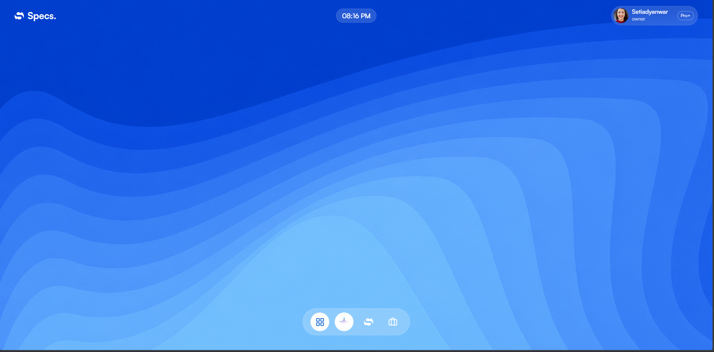
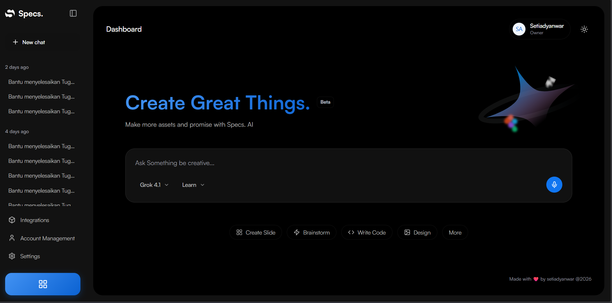
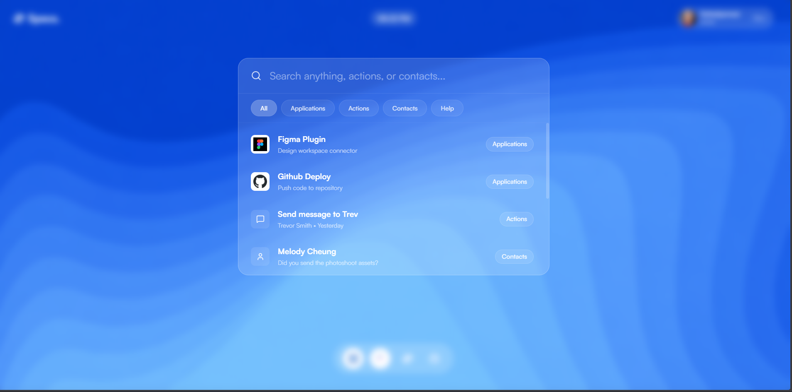
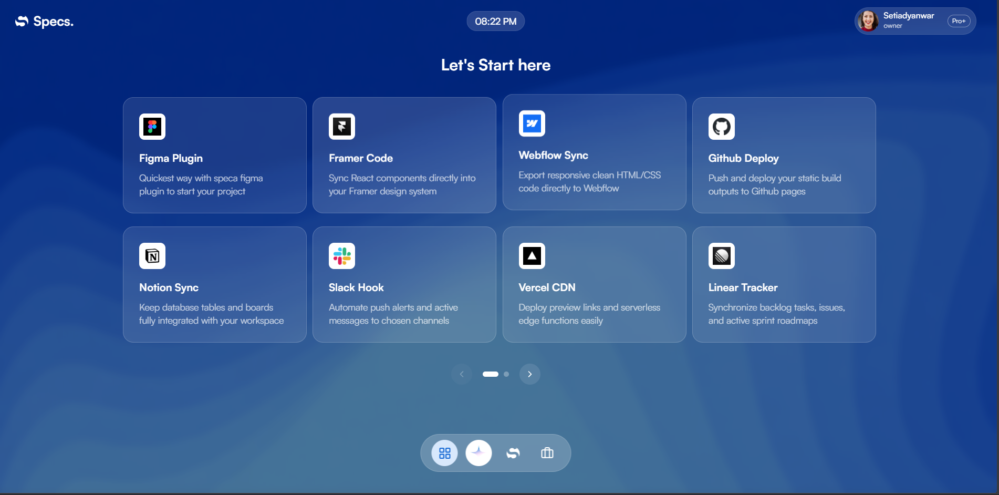

# 🪐 Specs OS | Specs. AI

> A revolutionary, premium cloud SaaS workspace platform disguised as a unified desktop operating system. Designed for hyper-productivity, it seamlessly integrates conversational AI, layout workspaces, custom launchers, and automations within a pixel-perfect, liquid-glass web interface.

---

## 📸 Screenshots

Here is how you can showcase the application. Save your captured screenshots in the `screenshots/` directory of the project, commit, and push them to GitHub. They will automatically render beautifully!

### 🖥️ Specs OS Desktop Launcher

*Vibrant Liquid Glass desktop launcher featuring horizontal paginated plugin cards, smooth trackpad gestures, and dynamic Spotlight Search.*

### 💬 Specs. AI Conversational Workspace

*Modern, clean conversational dashboard equipped with adaptive light/dark theme switching, quick actions, and smart context chips.*

### 🔍 Global Spotlight Search Console

*Keyboard-activated global search overlay featuring category pill filtering, auto-focus input, and a custom transparent scrollbar.*

### 🎮 Drag-and-Swipe Application Gallery

*Dynamic paginated plugin launcher supporting mouse dragging, touchscreen swiping, and two-finger trackpad horizontal slides with elastic rubberband physics.*

---

## ✨ Features

- **🌀 Fluid Page-Sliding Launcher**: Drag-to-slide, touch-swipe, and **2-finger horizontal trackpad gestures** with Apple-style rubberbanding and inertia cooldowns.
- **🔍 macOS Spotlight Search**: Global keyboard-first navigation triggered by `/`, autofocus input, capsule category filters, and real-time result indexing.
- **💎 Frosted Liquid-Glass UI**: A modern design system relying on frosted transclucent glass layers (`backdrop-filter: blur`), thin custom scrollbars, and high-contrast typography.
- **🎨 Reactive Theme Switching**: Adaptive dark and light modes, including dynamic logomark state updates (`specs-fill.svg` / `specs-white.svg`) reactive to user preference.
- **⚙️ Desktop Environment**: Sleek top menu bar, interactive profile drawer, customizable full-width layout toggle, and interactive dock apps.

---

## 🌟 Key Components

### 🔍 macOS-Style Spotlight Search
Specs OS includes a lightning-fast, keyboard-first Spotlight Search overlay modeled after modern desktop OS experiences:
- **Instant Activation**: Press `/` from anywhere on the desktop to immediately call up the search console. Press `Escape` to dismiss it.
- **Auto-Focus Input**: Instant input focus upon toggle for keyboard-ready searching.
- **Dynamic Capsule Filters**: Filter results on-the-fly using sleek glass pill tabs: `All`, `Applications`, `Actions`, `Contacts`, and `Help`.
- **Fuzzy Real-Time Search**: Queries titles and descriptions dynamically to yield matching results instantly.
- **Mac-Style Smooth Scroll**: A custom, transparent thin scrollbar that conforms to our premium translucent theme without breaking container alignments.

### 🎮 Drag-to-Slide Application Gallery
The desktop home screen features an interactive 2-row paginated grid displaying **12 pre-configured industry plugins** (Figma, Framer, Webflow, Notion, Slack, Vercel, Linear, Cursor, Canva, ChatGPT, Midjourney, and GitHub):
- **1-to-1 Interactive Dragging**: Click and drag horizontally with your mouse or swipe with your finger on touchscreens; the launcher cards track your movements in real-time.
- **Elastic Rubberband Physics**: Dragging past bounds (page 1 left or page 2 right) applies a physical `0.3` resistance coefficient, creating a smooth bouncy boundary feel.
- **Trackpad Horizontal Gestures**: Supports modern **two-finger swipes on laptop trackpads**! Uses non-passive listeners to bypass default browser page history swiping, delivering a fluid native feel.
- **Smart Snap Cooldown**: Uses a `600ms` momentum lock to prevent rapid page-skipping, ensuring snaps land precisely on the next page.

---

## 🚀 Getting Started

To run the application locally on your computer, follow these simple steps:

### 1. Clone the Repository
```bash
git clone https://github.com/setiadyanwar/specs-saas.git
cd specs-saas
```

### 2. Install Dependencies
```bash
npm install
```

### 3. Run Development Server
```bash
npm run dev
```
Open your browser and navigate to `http://localhost:5173`.

---

## 📁 Project Structure

```text
├── public/
│   ├── specs-fill.svg       # Brand logo for light backgrounds
│   ├── specs-white.svg      # Brand logo for dark/glass backgrounds
│   ├── specs-ai.svg         # Specs AI custom dock icon
│   └── specaOS-bg.png       # Premium wallpaper canvas
├── src/
│   ├── components/          # Reusable UI elements (PromptInput, etc.)
│   ├── pages/
│   │   ├── Desktop.tsx      # Specs OS Desktop launcher environment
│   │   └── Dashboard.tsx    # Specs. AI workspace & chat dashboard
│   ├── App.tsx              # Application routing & root
│   ├── App.css              # Custom layout, widgets & scrollbar styles
│   └── index.css            # Base design system tokens & Tailwind replacements
├── screenshots/             # Put your captured screenshots here!
└── README.md
```

---

## 🛠️ Built With

- **Vite + React** - Lightning-fast build tool and interactive UI component architecture.
- **TypeScript** - Full static type-checking and autocompletion safety.
- **Lucide React** - Clean, minimalistic vector icons.
- **Vanilla CSS** - High-fidelity layout rendering, animations, and backdrop filtering.

---

Made with ❤️ by [setiadyanwar](https://github.com/setiadyanwar) @2026
